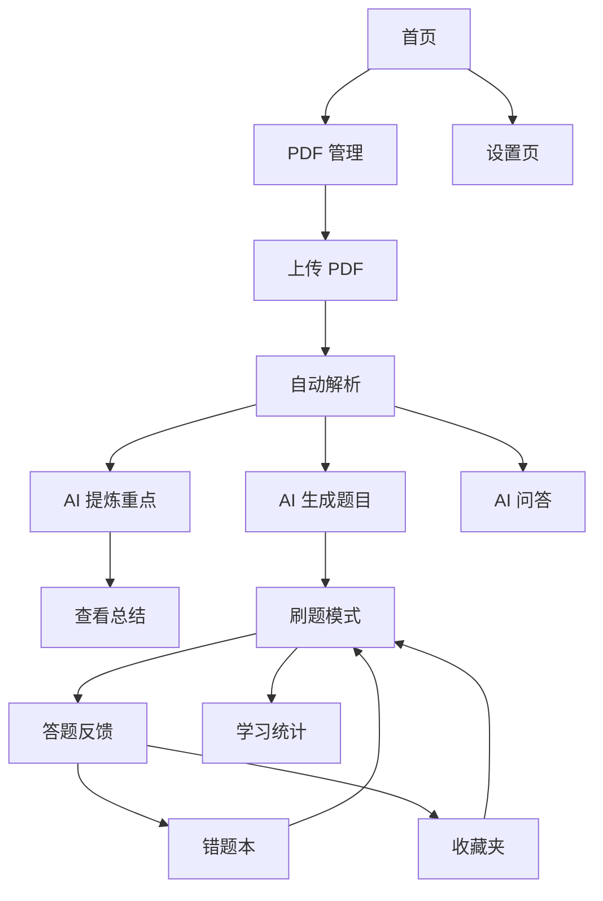

# AI 智能考试助手 - 产品需求文档

## 1. 产品概述

AI 智能考试助手是一款面向大学生的前端应用，用户上传 PDF 题库后，系统自动解析文档内容，通过 AI 生成考试重点、知识总结、在线刷题、错题本、AI 问答等功能，帮助学生高效复习备考。纯前端架构，所有数据存储在浏览器本地，AI 能力通过第三方 API 实现。

- 目标用户：大学生（期末考试周复习场景）
- 核心价值：将传统手动整理题库的流程自动化，提升复习效率

## 2. 核心功能

### 2.1 功能模块

1. **PDF 管理**：拖拽/点击上传、上传历史、PDF 预览、多文件管理、删除、解析状态查看
2. **AI 提炼重点**：高频考点、必背知识点、核心概念、易错点、思维导图、章节总结
3. **AI 自动生成题目**：单选题、多选题、判断题、填空题、简答题，含题目/选项/答案/解析/章节
4. **刷题模式**：顺序练习、随机练习、章节练习、错题练习、收藏练习，答题后即时反馈
5. **错题本与收藏夹**：自动保存错题/收藏题，支持删除、再练、AI 重新讲解、导出
6. **AI 问答**：针对当前 PDF 提问，AI 基于文档内容回答
7. **学习统计**：今日学习时间、完成题数、正确率、连续学习天数、章节掌握度（ECharts 图表）
8. **数据持久化**：所有数据 LocalStorage 存储，刷新不丢失

### 2.2 页面详情

| 页面名称 | 模块名称 | 功能描述 |
|---------|---------|---------|
| 首页 | 导航与概览 | 展示应用入口、学习概览卡片、快速导航 |
| PDF 管理页 | 文件上传与列表 | 拖拽上传区域、文件列表、解析状态、删除操作 |
| PDF 阅读页 | 文档预览 | PDF 在线预览、页面导航 |
| AI 总结页 | 重点提炼 | 高频考点、知识点总结、思维导图（Markdown 渲染）、章节总结 |
| AI 生成题目页 | 题目生成 | 选择题型和数量、生成题目列表、查看答案解析 |
| 刷题页 | 答题练习 | 顺序/随机/章节/错题/收藏模式、答题即时反馈、正确答案与解析 |
| 错题本页 | 错题管理 | 错题列表、删除、再练一次、AI 重新讲解、导出 |
| 收藏夹页 | 收藏管理 | 收藏题目列表、删除、练习 |
| AI 问答页 | 智能问答 | 输入问题、AI 基于 PDF 回答、对话历史 |
| 学习统计页 | 数据可视化 | 学习时间、题数、正确率、连续天数、章节掌握度图表 |
| 设置页 | 应用配置 | API Key 配置、模型选择、数据清理、深色模式切换 |

## 3. 核心流程

用户打开应用 → 首页查看概览 → 进入 PDF 管理页上传题库 → 系统自动解析 PDF 文本 → 进入 AI 总结页生成重点 → 进入 AI 生成题目页生成练习题 → 进入刷题页练习 → 答题记录自动保存 → 错题自动归入错题本 → 可随时进入 AI 问答页提问 → 学习统计页查看进度

## 4. 用户界面设计

### 4.1 设计风格

- 主色调：浅灰白底（#F9FAFB）+ 深色文字（#111827）
- 强调色：温暖的橙色系（#F59E0B）用于按钮和重点标记
- 辅助色：绿色（#10B981）表示正确，红色（#EF4444）表示错误
- 按钮风格：圆角（rounded-lg）、扁平化、无阴影或极轻阴影
- 字体：系统字体栈（-apple-system, BlinkMacSystemFont, Segoe UI 等）
- 布局：卡片式布局、顶部导航栏 + 侧边栏（PC）、底部导航（移动端）
- 图标：Lucide Icons 统一风格
- 动画：自然过渡（transition 200-300ms）、加载骨架屏

### 4.2 页面设计概览

| 页面名称 | 模块名称 | UI 元素 |
|---------|---------|--------|
| 首页 | 概览卡片 | 白色卡片、圆角、轻阴影、统计数字突出显示 |
| PDF 管理 | 上传区域 | 虚线边框拖拽区、文件卡片列表、状态标签 |
| 刷题页 | 答题区 | 选项卡片、选中高亮、正确/错误颜色反馈 |
| AI 问答 | 对话区 | 类 ChatGPT 气泡布局、Markdown 渲染 |
| 学习统计 | 图表区 | ECharts 柱状图/折线图/饼图、浅色配色 |

### 4.3 响应式策略

- 桌面优先（≥1024px）：侧边栏导航 + 主内容区
- 平板（768px-1023px）：折叠侧边栏为顶部导航
- 移动端（<768px）：底部 Tab 导航、单列布局、触控优化
