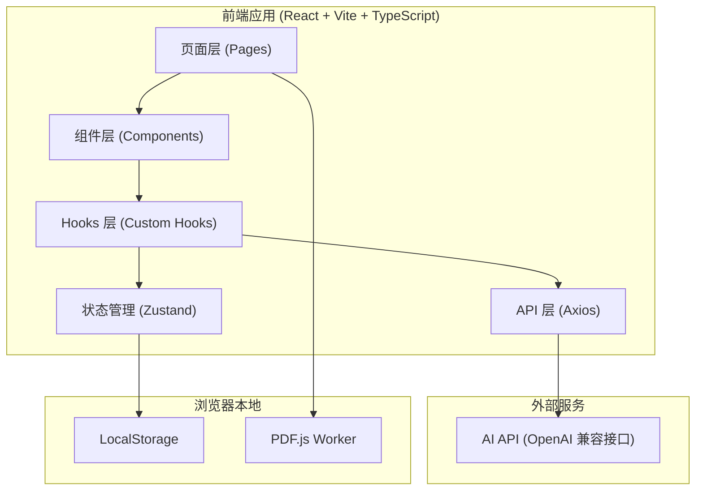

# AI 智能考试助手 - 技术架构文档

## 1. 架构设计



## 2. 技术描述

- 前端框架：React 18 + TypeScript
- 构建工具：Vite 5
- 路由：React Router v6
- 样式：Tailwind CSS 3
- 状态管理：Zustand
- HTTP 客户端：Axios
- PDF 解析：PDF.js (pdfjs-dist)
- Markdown 渲染：react-markdown + remark-gfm
- 图表：ECharts + echarts-for-react
- 图标：lucide-react
- 后端：无
- 数据库：LocalStorage

## 3. 路由定义

| 路由 | 页面 | 描述 |
|------|------|------|
| / | 首页 | 学习概览与快速导航 |
| /pdf | PDF 管理 | 上传、管理 PDF 文件 |
| /pdf/:id | PDF 阅读 | 在线预览 PDF |
| /pdf/:id/summary | AI 总结 | AI 提炼重点与知识点 |
| /pdf/:id/generate | 题目生成 | AI 生成练习题 |
| /practice/:pdfId | 刷题 | 答题练习 |
| /practice/:pdfId/:mode | 刷题模式 | 顺序/随机/章节/错题/收藏 |
| /wrong-book | 错题本 | 错题管理 |
| /favorites | 收藏夹 | 收藏题目管理 |
| /chat/:pdfId | AI 问答 | 针对 PDF 的智能问答 |
| /statistics | 学习统计 | 数据可视化 |
| /settings | 设置 | 应用配置 |

## 4. API 定义

### 4.1 AI API 调用（OpenAI 兼容格式）

```typescript
// API 请求类型
interface ChatMessage {
  role: 'system' | 'user' | 'assistant';
  content: string;
}

interface ChatCompletionRequest {
  model: string;
  messages: ChatMessage[];
  temperature?: number;
  max_tokens?: number;
  stream?: boolean;
}

// API 响应类型
interface ChatCompletionResponse {
  id: string;
  choices: {
    message: {
      role: string;
      content: string;
    };
    finish_reason: string;
  }[];
  usage: {
    prompt_tokens: number;
    completion_tokens: number;
    total_tokens: number;
  };
}
```

### 4.2 业务数据类型

```typescript
// PDF 文件
interface PdfFile {
  id: string;
  name: string;
  size: number;
  uploadTime: number;
  status: 'uploading' | 'parsing' | 'ready' | 'error';
  textContent?: string;
  pageCount?: number;
}

// AI 总结
interface AiSummary {
  pdfId: string;
  keyPoints: string[];
  knowledgePoints: string[];
  coreConcepts: string[];
  easyMistakes: string[];
  mindMap: string; // Markdown
  chapterSummaries: { chapter: string; summary: string }[];
  generatedAt: number;
}

// 题目
interface Question {
  id: string;
  pdfId: string;
  type: 'single' | 'multiple' | 'judge' | 'fill' | 'short';
  question: string;
  options?: string[];
  answer: string | string[];
  explanation: string;
  chapter: string;
}

// 答题记录
interface AnswerRecord {
  questionId: string;
  pdfId: string;
  userAnswer: string | string[];
  isCorrect: boolean;
  answeredAt: number;
  timeSpent: number; // 秒
}

// 学习统计
interface StudyStats {
  todayStudyTime: number; // 秒
  todayCompletedCount: number;
  totalCorrectRate: number;
  streakDays: number;
  chapterMastery: { chapter: string; rate: number }[];
  weeklyData: { date: string; count: number; correctRate: number }[];
}
```

## 5. 数据模型

### 5.1 LocalStorage 存储结构

| Key | 类型 | 描述 |
|-----|------|------|
| exam_pdf_files | PdfFile[] | PDF 文件元数据（不含文件内容） |
| exam_pdf_text_{id} | string | 各 PDF 解析后的文本内容 |
| exam_ai_summary_{pdfId} | AiSummary | AI 生成的重点总结 |
| exam_questions_{pdfId} | Question[] | AI 生成的题目列表 |
| exam_answer_records | AnswerRecord[] | 所有答题记录 |
| exam_wrong_questions | string[] | 错题 ID 列表 |
| exam_favorites | string[] | 收藏题 ID 列表 |
| exam_chat_history_{pdfId} | ChatMessage[] | AI 问答对话历史 |
| exam_study_stats | StudyStats | 学习统计数据 |
| exam_settings | Settings | 应用设置（API Key、模型等） |

### 5.2 目录结构

```
src/
├── api/                    # API 调用层
│   ├── ai.ts              # AI API 封装
│   └── prompts.ts         # Prompt 模板
├── components/             # 通用组件
│   ├── ui/                # 基础 UI 组件
│   │   ├── Button.tsx
│   │   ├── Card.tsx
│   │   ├── Input.tsx
│   │   ├── Modal.tsx
│   │   ├── Skeleton.tsx
│   │   ├── Tabs.tsx
│   │   └── Tag.tsx
│   ├── layout/            # 布局组件
│   │   ├── AppLayout.tsx
│   │   ├── Sidebar.tsx
│   │   ├── Header.tsx
│   │   └── BottomNav.tsx
│   └── shared/            # 业务通用组件
│       ├── PdfUploader.tsx
│       ├── QuestionCard.tsx
│       ├── MarkdownViewer.tsx
│       └── LoadingSpinner.tsx
├── pages/                  # 页面组件
│   ├── Home.tsx
│   ├── PdfManage.tsx
│   ├── PdfViewer.tsx
│   ├── AiSummary.tsx
│   ├── GenerateQuestions.tsx
│   ├── Practice.tsx
│   ├── WrongBook.tsx
│   ├── Favorites.tsx
│   ├── AiChat.tsx
│   ├── Statistics.tsx
│   └── Settings.tsx
├── stores/                 # Zustand 状态管理
│   ├── pdfStore.ts
│   ├── questionStore.ts
│   ├── studyStore.ts
│   └── settingsStore.ts
├── hooks/                  # 自定义 Hooks
│   ├── usePdfParser.ts
│   ├── useAi.ts
│   ├── usePractice.ts
│   └── useStudyStats.ts
├── types/                  # TypeScript 类型定义
│   ├── pdf.ts
│   ├── question.ts
│   ├── study.ts
│   └── api.ts
├── utils/                  # 工具函数
│   ├── storage.ts
│   ├── format.ts
│   └── id.ts
├── constants/              # 常量
│   └── index.ts
├── router/                 # 路由配置
│   └── index.tsx
├── App.tsx
├── main.tsx
└── index.css
```
